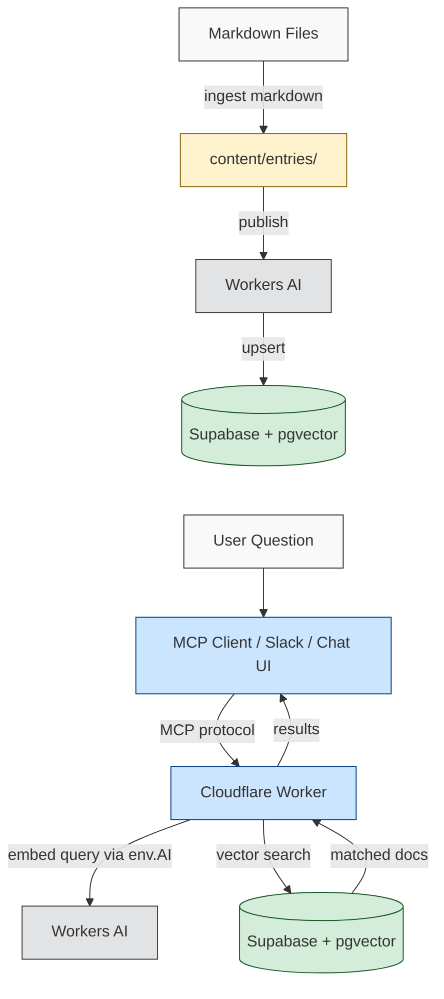

# Company Docs MCP

Turn any documentation into an AI-searchable knowledge base. Ingest markdown files, push them to Supabase with vector embeddings, and query them through any MCP-compatible client, Slack, or a built-in chat interface — all powered by the [Model Context Protocol](https://modelcontextprotocol.io).

## What This Does

1. **Ingest** — Point the CLI at a folder of markdown files. It parses them into structured content entries.
2. **Publish** — Push those entries to Supabase with vector embeddings for semantic search.
3. **Query** — Connect the deployed MCP server to any MCP-compatible client (Claude, Cursor, Windsurf, etc.), Slack, or the built-in chat UI. Ask questions in natural language and get answers sourced from your documentation.

This works for any kind of documentation: design systems, engineering guides, HR policies, operations playbooks, product specs, onboarding materials — anything you can write in markdown.

## Architecture

The system has three components that work together:

```
┌─────────────────────────────────────────────────────────────────┐
│ YOUR MACHINE (setup + ingestion)                                │
│                                                                 │
│  Markdown files ──► CLI ──► Cloudflare Workers AI ──► Supabase  │
│                     (npm package)   (REST API)      (pgvector)  │
└─────────────────────────────────────────────────────────────────┘
                                                          │
┌─────────────────────────────────────────────────────────────────┐
│ CLOUDFLARE (always running)                              │      │
│                                                          ▼      │
│  MCP Client ──► Cloudflare Worker ──► Workers AI ──► Supabase   │
│  Slack             (your server)    (env.AI binding)  (search)  │
│  Chat UI                                                        │
└─────────────────────────────────────────────────────────────────┘
```

| Component | What it does | Why you need it |
|-----------|-------------|-----------------|
| **Cloudflare Workers** | Hosts your MCP server and generates embeddings via Workers AI | This is where your server runs. Workers AI provides free, fast embedding generation with zero additional API keys. |
| **Supabase** | Stores your documentation as vectors in a PostgreSQL database with pgvector | Enables semantic search — "find docs about deployment" matches content about CI/CD, releases, and shipping, not just the word "deployment." |
| **npm package** | CLI tool that parses markdown and publishes to Supabase | You run this on your machine to ingest and update content. |

**No third-party AI API keys are required for search.** The Cloudflare Worker uses its built-in Workers AI binding for embeddings at query time (zero latency, zero cost). The CLI uses the Cloudflare REST API for embeddings during ingestion (same Cloudflare account you already use for hosting).

## Requirements

- **Node.js 18+** ([download](https://nodejs.org/))
- **Cloudflare account** — for hosting the Worker and generating embeddings ([sign up](https://dash.cloudflare.com/sign-up), free tier works)
- **Supabase account** — for the vector database ([supabase.com](https://supabase.com), free tier works)

That's it. No OpenAI, no Anthropic, no Google API keys needed.

## Setup Guide

The steps below walk through the complete setup in dependency order — each step builds on the previous one.

### Step 1: Install the Package

```bash
npm install company-docs-mcp
```

**What this does:** Downloads the CLI tool and its dependencies to your project. No external services are contacted yet.

### Step 2: Create a Supabase Project

Your documentation needs a database to store content and vector embeddings for search.

1. Go to [supabase.com](https://supabase.com) and create a new project
2. Navigate to **Settings > API** and copy three values:
   - **Project URL** (e.g., `https://abc123.supabase.co`)
   - **anon key** (public, used by the Worker for read access)
   - **service_role key** (private, used for ingestion writes)
3. Open the **SQL Editor**, paste the contents of [`database/schema.sql`](database/schema.sql), and click **Run**

**What this does:** Creates the `content_entries` and `content_chunks` tables with pgvector columns, HNSW indexes for fast similarity search, and the search functions the Worker calls at query time.

> The schema file is included in the npm package at `node_modules/company-docs-mcp/database/schema.sql`.

### Step 3: Set Up Cloudflare Credentials

The CLI needs Cloudflare credentials to generate embeddings during ingestion. These are the same credentials you'll use to deploy the Worker later.

1. Log in to [dash.cloudflare.com](https://dash.cloudflare.com)
2. Copy your **Account ID** from the right sidebar of the overview page
3. Go to **My Profile > API Tokens > Create Token**
4. Use the **"Custom token"** template with these permissions:
   - **Account > Workers AI > Read** (for embedding generation)
   - **Account > Workers Scripts > Edit** (for deploying the Worker later)
   - **Account > Workers KV Storage > Edit** (for the search cache)
5. Copy the generated token

**What this does:** Gives the CLI permission to call Workers AI for embedding generation, and gives Wrangler permission to deploy and manage your Worker.

### Step 4: Configure Environment

Create a `.env` file in your project root:

```env
# Supabase — where your documentation vectors are stored
SUPABASE_URL=https://your-project.supabase.co
SUPABASE_ANON_KEY=eyJ...
SUPABASE_SERVICE_KEY=eyJ...

# Cloudflare — for generating embeddings during ingestion
CLOUDFLARE_ACCOUNT_ID=your-account-id
CLOUDFLARE_API_TOKEN=your-api-token
```

**What this does:** Connects the CLI to your Supabase database and Cloudflare account. The CLI reads these values when you run `publish`.

### Step 5: Write Your Documentation

Create markdown files in a directory. Any structure works:

```
docs/
├── onboarding/
│   ├── new-hire-checklist.md
│   └── tools-and-access.md
├── engineering/
│   ├── deployment-guide.md
│   └── code-review-process.md
├── policies/
│   ├── pto-policy.md
│   └── expense-guidelines.md
└── product/
    ├── feature-specs.md
    └── release-process.md
```

### Step 6: Ingest and Publish

```bash
# Parse markdown files into structured entries
npx company-docs ingest markdown --dir=./docs

# Push entries to Supabase with Workers AI embeddings
npx company-docs publish
```

**What this does:**
1. `ingest markdown` reads your files, extracts titles from headings, and chunks content by section. Parsed entries are saved as JSON in `content/entries/`.
2. `publish` sends each entry to Cloudflare Workers AI for vectorization (1024-dimension embeddings), then upserts the content and vectors into Supabase. A SHA-256 content hash skips unchanged entries automatically.

To preview what would be published without writing to the database:

```bash
npx company-docs publish --dry-run
```

### Step 7: Deploy the Cloudflare Worker

The Worker is the always-running server that handles search queries from MCP clients, Slack, and the chat UI. Deploy it from the cloned repository:

```bash
git clone https://github.com/southleft/company-docs-mcp.git
cd company-docs-mcp
npm install
```

#### Authenticate Wrangler

```bash
npx wrangler login
```

This opens a browser window for Cloudflare OAuth. Once complete, Wrangler can deploy to your account.

> **Important:** If you have a `CLOUDFLARE_API_TOKEN` set in your shell environment or `.env`, it can conflict with `wrangler login`. Comment it out before running `wrangler login`, then restore it after.

#### Configure wrangler.toml

```toml
name = "company-docs-mcp"
main = "src/index.ts"
compatibility_date = "2024-01-01"
compatibility_flags = ["nodejs_compat"]

# Workers AI binding — gives the Worker direct access to embedding models
# No API key needed at runtime; this is a built-in Cloudflare service
[ai]
binding = "AI"

[vars]
ORGANIZATION_NAME = "Your Organization"
VECTOR_SEARCH_ENABLED = "true"
VECTOR_SEARCH_MODE = "vector"
```

#### Create a KV namespace

The Worker caches search results in Cloudflare KV to reduce repeated database calls (5-minute TTL, automatically expires).

```bash
npx wrangler kv namespace create CONTENT_CACHE
```

Add the returned ID to your `wrangler.toml`:

```toml
[[kv_namespaces]]
binding = "CONTENT_CACHE"
id = "your-kv-namespace-id"
```

#### Set secrets

Secrets are encrypted and only available to your Worker at runtime. They never appear in `wrangler.toml` or the dashboard in plain text.

```bash
# Required — connects the Worker to your Supabase database
echo "your-supabase-url" | npx wrangler secret put SUPABASE_URL
echo "your-anon-key" | npx wrangler secret put SUPABASE_ANON_KEY
echo "your-service-key" | npx wrangler secret put SUPABASE_SERVICE_KEY
```

OpenAI is not required for search — the Worker uses its built-in Workers AI binding.

#### Deploy

```bash
npm run deploy
```

Your MCP server is now live at `https://company-docs-mcp.<your-subdomain>.workers.dev`.

### Step 8: Connect Your MCP Client

The MCP endpoint is:

```
https://company-docs-mcp.<your-subdomain>.workers.dev/mcp
```

**Claude:** Settings > Connectors > Add custom connector > paste the URL.

**Cursor / Windsurf / Other clients:** Add the URL as a remote MCP server in your client's settings.

The server provides these tools (all query Supabase directly):

| Tool | Description |
|------|-------------|
| `search_documentation` | Semantic vector search across all documentation |
| `search_chunks` | Search specific content chunks with section context |
| `browse_by_category` | Browse documentation by category (categories are dynamic — whatever you use during ingestion) |
| `get_all_tags` | List all available tags across your documentation |

## How It Works



**Ingestion (you run this once, or whenever docs change):**

1. **Parse** — `ingest markdown` reads your files, extracts titles from headings, and chunks content by section
2. **Store locally** — Parsed entries are saved as JSON in `content/entries/` with deterministic IDs (same file = same ID, no duplicates)
3. **Publish** — `publish` sends each entry to Workers AI for vectorization, then upserts into Supabase. A SHA-256 content hash skips unchanged entries automatically

**Query (happens every time someone asks a question):**

1. The query is embedded using Workers AI via the Worker's built-in `env.AI` binding (zero latency, no API key)
2. Supabase's `pgvector` extension finds the most similar documents via cosine distance
3. Results are returned through the MCP server to your MCP client, Slack, or the chat UI

## CLI Reference

```
company-docs <command> [options]
```

### Commands

| Command | Description |
|---------|-------------|
| `ingest markdown` | Parse markdown files into `content/entries/` |
| `ingest supabase` | Push entries to Supabase with embeddings |
| `publish` | Alias for `ingest supabase` |
| `manifest` | Generate `content/manifest.json` for Workers deployment |

### Ingest Markdown Options

| Option | Description | Default |
|--------|-------------|---------|
| `--dir`, `-d` | Directory containing markdown files | `./docs` |
| `--category`, `-c` | Category label for the content | `documentation` |
| `--recursive` | Search subdirectories | `true` |
| `--verbose`, `-v` | Show detailed output | `false` |

### Ingest Supabase Options

| Option | Description |
|--------|-------------|
| `--clear` | Delete all existing data before ingesting (destructive) |
| `--dry-run` | Preview changes without writing to the database |
| `--verbose` | Show detailed per-entry progress |

### Examples

```bash
# Ingest engineering docs with a specific category
npx company-docs ingest markdown --dir=./docs/engineering --category=engineering

# Ingest HR policies
npx company-docs ingest markdown --dir=./policies --category=hr

# Ingest from multiple directories, then publish once
npx company-docs ingest markdown --dir=./docs/api --category=api-reference
npx company-docs ingest markdown --dir=./docs/guides --category=guides
npx company-docs publish

# Full re-ingestion (clears database first)
npx company-docs publish --clear

# Preview what would change
npx company-docs publish --dry-run --verbose
```

## Incremental Updates

The system is designed for repeated runs:

- **Content hashing** — Only entries whose content has changed are re-embedded, saving API calls
- **Deterministic IDs** — The same file always produces the same ID, preventing duplicates
- **Stale cleanup** — Entries removed from your docs directory are automatically cleaned up
- **Deduplication** — If duplicates exist in the database, older copies are removed during ingestion

```bash
# Update docs and re-publish — only changes are processed
npx company-docs ingest markdown --dir=./docs
npx company-docs publish
```

## Additional Ingestion Sources

When running from the cloned repository (not the npm package), additional ingestion methods are available:

```bash
# Crawl a website
npm run ingest:web -- --url=https://docs.example.com

# Import from CSV with URLs
npm run ingest:csv -- urls.csv

# Import a single URL
npm run ingest:url https://example.com/page

# Import PDFs
npm run ingest:pdf ./document.pdf
```

## Optional: Slack Integration

The MCP server includes a Slack slash command that lets team members query documentation:

```
/docs deployment process
/docs PTO policy
/docs how to set up staging
```

See [docs/SLACK_SETUP.md](docs/SLACK_SETUP.md) for setup instructions.

## Optional: Chat Interface

The deployed Worker serves a branded chat UI at its root URL. The chat UI has two modes:

- **Search mode** — uses Workers AI embeddings to find relevant documentation. No OpenAI key needed.
- **AI chat mode** — sends a question to OpenAI GPT-4o, which searches your docs and synthesizes a conversational answer. Requires `OPENAI_API_KEY` set as a Worker secret.

Search, MCP tools, and Slack all work without OpenAI. The AI chat mode is the only feature that uses it.

Customize the UI with environment variables:

```toml
[vars]
ORGANIZATION_NAME = "Your Organization"
ORGANIZATION_LOGO_URL = "https://example.com/logo.svg"
ORGANIZATION_TAGLINE = "Ask anything about our documentation"
```

See [docs/BRANDING.md](docs/BRANDING.md) for full branding options.

## Optional: OpenAI Embeddings

If you prefer OpenAI embeddings over Workers AI, set `OPENAI_API_KEY` in your `.env`:

```env
OPENAI_API_KEY=sk-...
EMBEDDING_PROVIDER=openai
```

| Provider | Model | Dimensions | When to use |
|----------|-------|------------|-------------|
| **Workers AI** (default) | `@cf/baai/bge-large-en-v1.5` | 1024 | Default. No extra API keys. Free on Cloudflare. |
| **OpenAI** | `text-embedding-3-small` | 1536 | If your organization already standardizes on OpenAI. |

**Important:** The embedding provider must match the database schema dimensions. The default `schema.sql` uses 1024 (Workers AI). If using OpenAI, change all `vector(1024)` to `vector(1536)` in the schema before running it. Switching providers on an existing database requires running the migration in `database/migrate-to-workers-ai.sql` and re-ingesting all content.

## Troubleshooting

**No results from search**
- Verify `npx company-docs publish` completed without errors
- Check that your `.env` has the correct Supabase credentials
- Run `npx company-docs publish --dry-run` to see what entries exist

**Duplicate entries**
- Re-run `npx company-docs ingest markdown` — stale entries are cleaned automatically
- Run `npx company-docs publish` — database duplicates are removed during ingestion

**Embedding errors during publish**
- Verify `CLOUDFLARE_ACCOUNT_ID` and `CLOUDFLARE_API_TOKEN` are set in `.env`
- Test your token: `curl -H "Authorization: Bearer YOUR_TOKEN" https://api.cloudflare.com/client/v4/user/tokens/verify`
- If using OpenAI: verify your API key is valid and has credits

**Wrangler login conflicts**
- If `npx wrangler login` fails, check for a `CLOUDFLARE_API_TOKEN` in your environment that may conflict with OAuth
- Comment out the token, run `wrangler login`, then restore it

**MCP client not connecting**
- Ensure the Worker is deployed and accessible
- Use the connector URL path `/mcp` (not just the root URL)
- Restart your MCP client after adding the connector

## Security

- Never commit `.env` files — they contain API keys
- Use `SUPABASE_SERVICE_KEY` for server-side operations (ingestion and Worker search)
- The `SUPABASE_ANON_KEY` respects Row Level Security policies
- Review [docs/SECURITY_KEY_ROTATION.md](docs/SECURITY_KEY_ROTATION.md) if you need to rotate credentials

## License

MIT — see [LICENSE](LICENSE) for details.

## Contributing

Issues and pull requests are welcome at [github.com/southleft/company-docs-mcp](https://github.com/southleft/company-docs-mcp).
