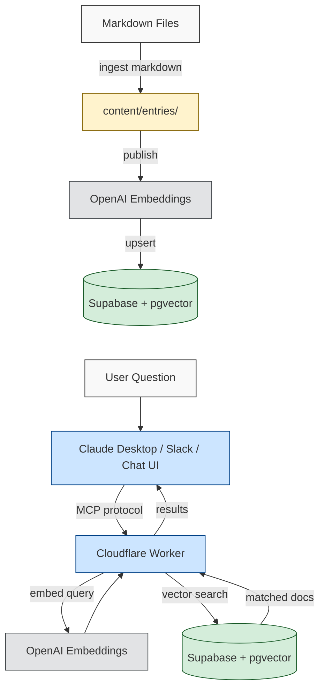

# Company Docs MCP

Turn any documentation into an AI-searchable knowledge base. Ingest markdown files, push them to Supabase with vector embeddings, and query them through Claude Desktop, Slack, or a built-in chat interface — all powered by the [Model Context Protocol](https://modelcontextprotocol.io).

## What This Does

1. **Ingest** — Point the CLI at a folder of markdown files. It parses them into structured content entries.
2. **Publish** — Push those entries to Supabase with OpenAI embeddings for semantic vector search.
3. **Query** — Connect the deployed MCP server to Claude Desktop, Slack, or any MCP-compatible client. Ask questions in natural language and get answers sourced from your documentation.

This works for any kind of documentation: design systems, engineering guides, HR policies, operations playbooks, product specs, onboarding materials — anything you can write in markdown.

## Requirements

- **Node.js 18+** ([download](https://nodejs.org/))
- **Supabase account** — free tier works ([supabase.com](https://supabase.com))
- **OpenAI API key** — for generating embeddings ([platform.openai.com](https://platform.openai.com/api-keys))
- **Cloudflare account** — for deploying the MCP server (optional for local dev)

## Install

```bash
npm install company-docs-mcp
```

Or with other package managers:

```bash
pnpm add company-docs-mcp
yarn add company-docs-mcp
```

## Quick Start

### 1. Set Up Supabase

Create a Supabase project and run the schema SQL to create the required tables:

1. Go to [supabase.com](https://supabase.com) and create a new project
2. Navigate to **Settings → API** and copy your **Project URL**, **anon key**, and **service_role key**
3. Open the **SQL Editor**, paste the contents of [`database/schema.sql`](database/schema.sql), and run it

The schema file is included in the npm package at `node_modules/company-docs-mcp/database/schema.sql`.

### 2. Configure Environment

Create a `.env` file in your project root:

```env
SUPABASE_URL=https://your-project.supabase.co
SUPABASE_ANON_KEY=eyJ...
SUPABASE_SERVICE_KEY=eyJ...
OPENAI_API_KEY=sk-...
```

### 3. Write Your Documentation

Create markdown files in a directory. Any structure works:

```
docs/
├── onboarding/
│   ├── new-hire-checklist.md
│   └── tools-and-access.md
├── engineering/
│   ├── deployment-guide.md
│   └── code-review-process.md
├── policies/
│   ├── pto-policy.md
│   └── expense-guidelines.md
└── product/
    ├── feature-specs.md
    └── release-process.md
```

### 4. Ingest and Publish

```bash
# Step 1: Parse markdown files into structured entries
npx company-docs ingest markdown --dir=./docs

# Step 2: Push to Supabase with vector embeddings
npx company-docs publish
```

That's it. Your documentation is now searchable via vector similarity.

### 5. Verify

Preview what would be published without writing to the database:

```bash
npx company-docs ingest supabase --dry-run
```

Re-run the pipeline any time you update your docs. The system uses content hashing — only changed entries are re-embedded and updated.

## CLI Reference

```
company-docs <command> [options]
```

### Commands

| Command | Description |
|---------|-------------|
| `ingest markdown` | Parse markdown files into `content/entries/` |
| `ingest supabase` | Push entries to Supabase with embeddings |
| `publish` | Alias for `ingest supabase` |
| `manifest` | Generate `content/manifest.json` for Workers deployment |

### Ingest Markdown Options

| Option | Description | Default |
|--------|-------------|---------|
| `--dir`, `-d` | Directory containing markdown files | `./docs` |
| `--category`, `-c` | Category label for the content | `documentation` |
| `--recursive` | Search subdirectories | `true` |
| `--verbose`, `-v` | Show detailed output | `false` |

### Ingest Supabase Options

| Option | Description |
|--------|-------------|
| `--clear` | Delete all existing data before ingesting (destructive) |
| `--dry-run` | Preview changes without writing to the database |
| `--verbose` | Show detailed per-entry progress |

### Examples

```bash
# Ingest engineering docs with a specific category
npx company-docs ingest markdown --dir=./docs/engineering --category=engineering

# Ingest HR policies
npx company-docs ingest markdown --dir=./policies --category=hr

# Ingest from multiple directories, then publish once
npx company-docs ingest markdown --dir=./docs/api --category=api-reference
npx company-docs ingest markdown --dir=./docs/guides --category=guides
npx company-docs publish

# Full re-ingestion (clears database first)
npx company-docs publish --clear

# Preview what would change
npx company-docs publish --dry-run --verbose
```

## How It Works



**Ingestion — you run this once (or whenever docs change):**

1. **Parse** — `ingest markdown` reads your files, extracts titles from headings, and chunks content by section
2. **Store locally** — Parsed entries are saved as JSON in `content/entries/` with deterministic IDs (same file = same ID, no duplicates)
3. **Publish** — `publish` sends each entry to OpenAI for embedding, then upserts into Supabase. A SHA-256 content hash skips unchanged entries automatically

**Query — happens every time someone asks a question:**

1. The query is embedded using the same OpenAI model
2. Supabase's `pgvector` extension finds the most similar documents via cosine distance
3. Results are returned through the MCP server to Claude Desktop, Slack, or any connected client

## Deploying the MCP Server

The npm package includes the CLI for ingestion. To serve the MCP endpoint that Claude Desktop and other clients connect to, deploy the Cloudflare Worker from the repository:

### 1. Clone the Repository

```bash
git clone https://github.com/southleft/company-docs-mcp.git
cd company-docs-mcp
npm install
```

### 2. Configure Cloudflare

Create a `wrangler.toml`:

```toml
name = "company-docs-mcp"
main = "src/index.ts"
compatibility_date = "2024-01-01"
compatibility_flags = ["nodejs_compat"]

[ai]
binding = "AI"

[vars]
ORGANIZATION_NAME = "Your Organization"
VECTOR_SEARCH_ENABLED = "true"
VECTOR_SEARCH_MODE = "vector"
```

Create a KV namespace for caching:

```bash
npx wrangler kv namespace create CONTENT_CACHE
# Add the returned ID to your wrangler.toml:
# [[kv_namespaces]]
# binding = "CONTENT_CACHE"
# id = "your-kv-namespace-id"
```

Set secrets:

```bash
echo "your-openai-api-key" | npx wrangler secret put OPENAI_API_KEY
echo "your-supabase-url" | npx wrangler secret put SUPABASE_URL
echo "your-anon-key" | npx wrangler secret put SUPABASE_ANON_KEY
echo "your-service-key" | npx wrangler secret put SUPABASE_SERVICE_KEY
```

### 3. Deploy

```bash
npm run deploy
```

Your MCP server will be available at `https://company-docs-mcp.<your-subdomain>.workers.dev`.

## Connecting to Claude Desktop

Once the Worker is deployed, add it as a connector in Claude Desktop:

1. Open **Claude Desktop** → **Settings** → **Connectors**
2. Click **Add custom connector**
3. Set the **URL** to `https://company-docs-mcp.<your-subdomain>.workers.dev/mcp`
4. Click **Add**

The connector provides these tools:

| Tool | Description |
|------|-------------|
| `search_documentation` | Semantic search across all documentation |
| `search_chunks` | Search specific content chunks |
| `browse_by_category` | Browse documentation by category |
| `get_all_tags` | List all available tags |

## Incremental Updates

The system is designed for repeated runs:

- **Content hashing** — Only entries whose content has changed are re-embedded, saving OpenAI API calls
- **Deterministic IDs** — The same file always produces the same ID, preventing duplicates
- **Stale cleanup** — Entries removed from your docs directory are automatically cleaned up
- **Deduplication** — If duplicates exist in the database, older copies are removed during ingestion

```bash
# Update docs and re-publish — only changes are processed
npx company-docs ingest markdown --dir=./docs
npx company-docs publish
```

## Additional Ingestion Sources

When running from the cloned repository (not the npm package), additional ingestion methods are available:

```bash
# Crawl a website
npm run ingest:web -- --url=https://docs.example.com

# Import from CSV with URLs
npm run ingest:csv -- urls.csv

# Import a single URL
npm run ingest:url https://example.com/page

# Import PDFs
npm run ingest:pdf ./document.pdf
```

## Optional: Slack Integration

The MCP server includes a Slack slash command that lets team members query documentation:

```
/docs deployment process
/docs PTO policy
/docs how to set up staging
```

Responses use a three-tier AI strategy for reliability: OpenAI (primary) → Cloudflare Workers AI (fallback) → formatted raw content. Results are automatically formatted for Slack with proper mrkdwn, bullet lists, and code blocks.

See [docs/SLACK_SETUP.md](docs/SLACK_SETUP.md) for setup instructions.

## Optional: Chat Interface

The deployed Worker serves a branded chat UI at its root URL. Customize it with environment variables:

```toml
[vars]
ORGANIZATION_NAME = "Your Organization"
ORGANIZATION_LOGO_URL = "https://example.com/logo.svg"
ORGANIZATION_TAGLINE = "Ask anything about our documentation"
```

See [docs/BRANDING.md](docs/BRANDING.md) for full branding options.

## Troubleshooting

**No results from search**
- Verify `npx company-docs publish` completed without errors
- Check that your `.env` has the correct Supabase credentials
- Run `npx company-docs publish --dry-run` to see what entries exist

**Duplicate entries**
- Re-run `npx company-docs ingest markdown` — stale entries are cleaned automatically
- Run `npx company-docs publish` — database duplicates are removed during ingestion

**Embedding errors**
- Verify your OpenAI API key is valid and has credits
- Check network connectivity to the OpenAI API

**Claude Desktop not connecting**
- Ensure the Worker is deployed and accessible
- Use the connector URL path `/mcp` (not just the root URL)
- Restart Claude Desktop after adding the connector

## Security

- Never commit `.env` files — they contain API keys
- Use `SUPABASE_SERVICE_KEY` for server-side operations (ingestion and Worker search)
- The `SUPABASE_ANON_KEY` respects Row Level Security policies
- Review [docs/SECURITY_KEY_ROTATION.md](docs/SECURITY_KEY_ROTATION.md) if you need to rotate credentials

## License

MIT — see [LICENSE](LICENSE) for details.

## Contributing

Issues and pull requests are welcome at [github.com/southleft/company-docs-mcp](https://github.com/southleft/company-docs-mcp).
