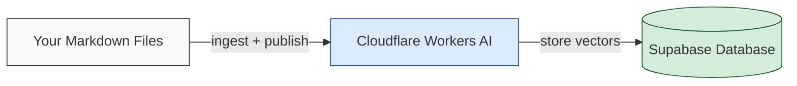
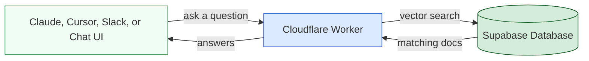

# Company Docs MCP

Turn any documentation into an AI-searchable knowledge base. Write your content in markdown, publish it to a database, and let anyone on your team query it through AI tools like Claude, Cursor, or Slack — all powered by the [Model Context Protocol](https://modelcontextprotocol.io).

## What This Does

1. **Write** — Create documentation as markdown files (design systems, HR policies, engineering guides, product specs — anything).
2. **Publish** — Run a command that reads your markdown, converts it into searchable vectors, and stores it in a database.
3. **Query** — Connect any MCP-compatible AI tool to your server. Ask questions in plain English and get answers sourced directly from your documentation.

## Two Ways to Use This

There are two distinct roles when working with Company Docs MCP. Most people on your team only need the first one.

### If someone already set up the server for your team

You just need a URL. No accounts, no installation, no terminal commands.

1. Get the server URL from whoever set it up (it looks like `https://company-docs-mcp.example.workers.dev/mcp`)
2. Add it to your AI tool:
   - **Claude:** Settings > Connectors > Add custom connector > paste the URL
   - **Cursor / Windsurf:** Add the URL as a remote MCP server in settings
3. Start asking questions about your documentation

That's it. Cloudflare, Supabase, and the CLI are only needed by the person who sets up and maintains the server.

### If you're setting up the server (admin/maintainer)

The rest of this README is for you. Follow the setup guide below to get everything running.

## How the Pieces Fit Together

The system uses three services. All three offer free tiers that are sufficient for most teams.

**Publishing (you do this):**



**Querying (your team does this):**



| Service | What it does | Why it's needed |
|---------|-------------|-----------------|
| **Cloudflare** | Hosts your server and converts text into searchable vectors using its built-in AI | This is where your server runs 24/7 so your team can query docs at any time. It also handles the AI processing that makes semantic search possible — no separate AI subscription needed. |
| **Supabase** | Stores your documentation in a PostgreSQL database with vector search | Powers "smart" search — asking "how do I deploy?" will find documents about releases, CI/CD, and shipping, not just pages containing the word "deploy." |
| **npm package** | A command-line tool that reads your markdown and publishes it to the database | You run this on your computer whenever you add or update documentation. |

**No third-party AI API keys are required.** Cloudflare provides the AI capabilities through its Workers AI service, which is included with every Cloudflare account at no extra cost.

## What You'll Need

Before starting, create free accounts on these two services:

- **Node.js 18 or later** — the runtime that powers the CLI tool ([download here](https://nodejs.org/))
- **A Cloudflare account** — for hosting and AI ([sign up here](https://dash.cloudflare.com/sign-up), free tier works)
- **A Supabase account** — for the database ([sign up here](https://supabase.com), free tier works)

That's it. No OpenAI, Anthropic, or Google API keys needed.

## Setup Guide

Follow these steps in order. Each one builds on the previous.

### Step 1: Install the Package

Open your terminal in the project where your documentation lives and run:

```bash
npm install company-docs-mcp
```

This downloads the CLI tool to your project. No external services are contacted yet.

### Step 2: Create Your Database (Supabase)

Your documentation needs a database to store content and make it searchable.

1. Go to [supabase.com](https://supabase.com) and create a new project
2. Go to **Settings > API** and copy three values (you'll need these in Step 4):
   - **Project URL** (looks like `https://abc123.supabase.co`)
   - **anon key** (a long string starting with `eyJ`)
   - **service_role key** (another long string starting with `eyJ` — keep this private)
3. Open the **SQL Editor** in the left sidebar, paste the contents of [`database/schema.sql`](database/schema.sql), and click **Run**

This creates the database tables and search functions the system uses.

> The schema file is included in the npm package at `node_modules/company-docs-mcp/database/schema.sql`.

### Step 3: Log In to Cloudflare

The CLI needs access to Cloudflare's AI service to convert your documentation into searchable vectors. The simplest way to connect is through the Wrangler CLI (Cloudflare's command-line tool, included with this package).

Run this command:

```bash
npx wrangler login
```

A browser window will open asking you to log in to your Cloudflare account and grant permission. Click **Allow** and return to your terminal.

You also need your **Cloudflare Account ID**:

1. Go to [dash.cloudflare.com](https://dash.cloudflare.com)
2. Your **Account ID** is shown on the right side of the overview page — copy it

That's the only Cloudflare setup needed for publishing. The CLI automatically detects the login credentials that `wrangler login` saved to your computer.

> **Token expiration:** The login session expires periodically. If you see an authentication error when publishing, just run `npx wrangler login` again.

### Step 4: Configure Your Environment

Create a file called `.env` in your project root with these values:

```env
# Supabase — where your documentation is stored
SUPABASE_URL=https://your-project.supabase.co
SUPABASE_ANON_KEY=eyJ...
SUPABASE_SERVICE_KEY=eyJ...

# Cloudflare — your Account ID (from Step 3)
CLOUDFLARE_ACCOUNT_ID=your-account-id
```

Replace the placeholder values with the ones you copied from Supabase (Step 2) and Cloudflare (Step 3).

> **Keep this file private.** Never commit `.env` to version control — it contains credentials. Add `.env` to your `.gitignore` file.

### Step 5: Write Your Documentation

Create markdown files in a directory. Any folder structure works:

```
docs/
├── onboarding/
│   ├── new-hire-checklist.md
│   └── tools-and-access.md
├── engineering/
│   ├── deployment-guide.md
│   └── code-review-process.md
├── policies/
│   ├── pto-policy.md
│   └── expense-guidelines.md
└── product/
    ├── feature-specs.md
    └── release-process.md
```

You can optionally add YAML frontmatter to control how each document is categorized:

```markdown
---
title: Deployment Guide
category: engineering
tags: [deploy, ci-cd, release]
description: How to deploy to production
---

# Deployment Guide

Your content here...
```

If you don't include frontmatter, the system will auto-detect a category and extract tags from the content.

### Step 6: Publish Your Documentation

Two commands turn your markdown files into a searchable knowledge base:

```bash
# Step 1: Parse markdown files into structured entries
npx company-docs ingest markdown --dir=./docs

# Step 2: Push entries to the database with AI-generated vectors
npx company-docs publish
```

**What happens:**
1. `ingest markdown` reads your files, extracts titles and sections, and saves structured entries to a `content/entries/` folder in your project.
2. `publish` sends each entry to Cloudflare's AI to generate search vectors, then stores everything in your Supabase database. A content hash automatically skips entries that haven't changed, so re-running is fast.

To preview what would be published without actually writing to the database:

```bash
npx company-docs publish --dry-run
```

**Updating documentation:** Whenever you edit your markdown files, run both commands again. Only changed entries are re-processed.

### Step 7: Deploy the Server (Cloudflare Worker)

The server is what runs 24/7 and handles search queries from your team's AI tools. It's deployed as a Cloudflare Worker.

#### Clone the repository

```bash
git clone https://github.com/southleft/company-docs-mcp.git
cd company-docs-mcp
npm install
```

#### Configure the Worker

Edit `wrangler.toml` with your organization name:

```toml
name = "company-docs-mcp"
main = "src/index.ts"
compatibility_date = "2024-01-01"
compatibility_flags = ["nodejs_compat"]

[ai]
binding = "AI"

[vars]
ORGANIZATION_NAME = "Your Organization"
VECTOR_SEARCH_ENABLED = "true"
VECTOR_SEARCH_MODE = "vector"
```

#### Create a search cache

The Worker caches recent search results to keep things fast. Run this command to create the cache:

```bash
npx wrangler kv namespace create CONTENT_CACHE
```

It will print an ID. Add it to `wrangler.toml`:

```toml
[[kv_namespaces]]
binding = "CONTENT_CACHE"
id = "the-id-that-was-printed"
```

#### Add your database credentials to the Worker

These are stored securely as encrypted secrets — they never appear in plain text in the dashboard or config files.

```bash
echo "your-supabase-url" | npx wrangler secret put SUPABASE_URL
echo "your-anon-key" | npx wrangler secret put SUPABASE_ANON_KEY
echo "your-service-key" | npx wrangler secret put SUPABASE_SERVICE_KEY
```

#### Deploy

Make sure you're logged in (you should be from Step 3 — if not, run `npx wrangler login` again), then:

```bash
npm run deploy
```

Your server is now live at `https://company-docs-mcp.<your-subdomain>.workers.dev`.

### Step 8: Connect and Test

Share this URL with your team:

```
https://company-docs-mcp.<your-subdomain>.workers.dev/mcp
```

**Claude:** Settings > Connectors > Add custom connector > paste the URL.

**Cursor / Windsurf / Other MCP clients:** Add the URL as a remote MCP server in your client's settings.

Once connected, your AI tool will have access to these search tools:

| Tool | What it does |
|------|-------------|
| `search_documentation` | Finds documentation that matches your question using semantic search |
| `search_chunks` | Searches specific sections within documents |
| `browse_by_category` | Lists all documentation in a category (categories come from your markdown frontmatter or the `--category` flag) |
| `get_all_tags` | Lists every tag used across your documentation |

## Cloudflare's Role — A Quick Summary

Since Cloudflare appears in several steps, here's a plain-language summary of what it does and when:

| When | What Cloudflare does | How it's accessed |
|------|---------------------|-------------------|
| **Publishing docs** (Step 6) | Converts your text into numerical vectors that enable semantic search | CLI calls the Cloudflare REST API using your `wrangler login` credentials |
| **Running the server** (Step 7+) | Hosts the always-on server that your team queries; generates vectors for incoming questions | Built-in — no API keys needed at runtime |

**Is Cloudflare optional?** No — it's required for both publishing and hosting. However, the free tier is more than sufficient and no separate AI subscription is needed. The only setup required is creating an account and running `npx wrangler login`.

## CLI Reference

```
company-docs <command> [options]
```

### Commands

| Command | Description |
|---------|-------------|
| `ingest markdown` | Parse markdown files into `content/entries/` |
| `publish` | Push entries to the database with AI-generated vectors |
| `ingest supabase` | Same as `publish` |
| `manifest` | Generate `content/manifest.json` (used during Worker deployment) |

### Ingest Markdown Options

| Option | Description | Default |
|--------|-------------|---------|
| `--dir`, `-d` | Folder containing your markdown files | `./docs` |
| `--category`, `-c` | Category label for the content (overrides frontmatter) | `documentation` |
| `--recursive` | Include files in subfolders | `true` |
| `--verbose`, `-v` | Show detailed output | `false` |

### Publish Options

| Option | Description |
|--------|-------------|
| `--clear` | Delete all existing data before publishing (start fresh) |
| `--dry-run` | Preview what would change without writing to the database |
| `--verbose` | Show detailed per-entry progress |

### Examples

```bash
# Ingest docs from different folders with different categories
npx company-docs ingest markdown --dir=./docs/engineering --category=engineering
npx company-docs ingest markdown --dir=./docs/policies --category=hr
npx company-docs publish

# Full re-publish from scratch
npx company-docs publish --clear

# Preview changes
npx company-docs publish --dry-run --verbose
```

## YAML Frontmatter Reference

Each markdown file can optionally include a YAML frontmatter block at the very top. The system reads these fields:

```yaml
---
title: Page Title
category: engineering
tags: [deploy, ci-cd, release]
description: A short summary of this page
status: stable
version: 1.0.0
source: src/path/to/source.ts
figma: https://figma.com/...
author: Jane Smith
department: Engineering
---
```

| Field | Effect |
|-------|--------|
| `title` | Used as the document title (overrides the first `# Heading`) |
| `category` | Sets the browseable category for this document |
| `tags` | Adds tags for filtering and discovery |
| `description` | Stored as metadata, returned in search results |
| `status` | Stored as metadata (e.g., `draft`, `stable`, `deprecated`) |
| `version` | Stored as metadata |
| `source`, `figma`, `author`, `department` | Stored as metadata, available in search results |

All fields are optional. If no frontmatter is present, the system auto-detects a category and extracts tags from the content.

**Priority order:** Frontmatter values take highest priority, followed by CLI flags (like `--category`), followed by auto-detection.

## Incremental Updates

The system is designed for repeated runs — you don't need to start from scratch each time:

- **Content hashing** — Only entries that have actually changed are re-processed
- **Deterministic IDs** — The same file always produces the same database ID, preventing duplicates
- **Stale cleanup** — Entries removed from your docs folder are automatically cleaned up from the database

```bash
# Edit your markdown, then re-publish — only changes are processed
npx company-docs ingest markdown --dir=./docs
npx company-docs publish
```

## Optional: Slack Integration

The server includes a Slack slash command so team members can search documentation directly from Slack:

```
/docs deployment process
/docs PTO policy
/docs how to set up staging
```

See [docs/SLACK_SETUP.md](docs/SLACK_SETUP.md) for setup instructions.

## Optional: Chat Interface

The server includes a web-based chat UI at its root URL (visit the Worker URL in a browser). It has two modes:

- **Search mode** — Finds relevant documentation using the same vector search as MCP. No additional setup needed.
- **AI chat mode** — Sends your question to OpenAI GPT-4o, which searches your docs and synthesizes a conversational answer. This is the only feature that requires an OpenAI API key (set as a Worker secret: `OPENAI_API_KEY`).

Customize the chat UI with environment variables in `wrangler.toml`:

```toml
[vars]
ORGANIZATION_NAME = "Your Organization"
ORGANIZATION_LOGO_URL = "https://example.com/logo.svg"
ORGANIZATION_TAGLINE = "Ask anything about our documentation"
```

See [docs/BRANDING.md](docs/BRANDING.md) for full branding options.

## Optional: OpenAI Embeddings

By default, the system uses Cloudflare's Workers AI for embeddings (free, no extra keys). If your organization prefers OpenAI, you can switch:

```env
OPENAI_API_KEY=sk-...
EMBEDDING_PROVIDER=openai
```

| Provider | Model | Dimensions | When to use |
|----------|-------|------------|-------------|
| **Workers AI** (default) | `@cf/baai/bge-large-en-v1.5` | 1024 | Default. No extra keys. Free on Cloudflare. |
| **OpenAI** | `text-embedding-3-small` | 1536 | If your organization already standardizes on OpenAI. |

**Important:** The embedding provider must match the database schema. The default `schema.sql` uses 1024 dimensions (Workers AI). If switching to OpenAI, change all `vector(1024)` to `vector(1536)` in the schema before running it.

## Troubleshooting

**No results from search**
- Verify `npx company-docs publish` completed without errors
- Check that your `.env` has the correct Supabase credentials
- Run `npx company-docs publish --dry-run` to see what entries exist

**Authentication error when publishing**
- Your `wrangler login` session may have expired — run `npx wrangler login` again
- Verify `CLOUDFLARE_ACCOUNT_ID` is set in your `.env`

**Duplicate entries**
- Re-run `npx company-docs ingest markdown` followed by `npx company-docs publish` — duplicates are cleaned up automatically

**MCP client not connecting**
- Make sure the Worker is deployed and accessible
- Use the `/mcp` path in the URL (not just the root URL)
- Restart your MCP client after adding the connector

**Wrangler login not working**
- If you have a `CLOUDFLARE_API_TOKEN` set in your environment or `.env` file, it can interfere with the login flow. Remove or comment it out, then try `npx wrangler login` again.

## Additional Ingestion Sources

When running from the cloned repository (not the npm package), additional ingestion methods are available:

```bash
# Crawl a website
npm run ingest:web -- --url=https://docs.example.com

# Import from CSV with URLs
npm run ingest:csv -- urls.csv

# Import a single URL
npm run ingest:url https://example.com/page

# Import PDFs
npm run ingest:pdf ./document.pdf
```

## Security

- Never commit `.env` files — they contain credentials
- The `SUPABASE_SERVICE_KEY` has full database access — keep it private
- The `SUPABASE_ANON_KEY` is restricted by Row Level Security policies (read-only)
- Review [docs/SECURITY_KEY_ROTATION.md](docs/SECURITY_KEY_ROTATION.md) if you need to rotate credentials

## License

MIT — see [LICENSE](LICENSE) for details.

## Contributing

Issues and pull requests are welcome at [github.com/southleft/company-docs-mcp](https://github.com/southleft/company-docs-mcp).
